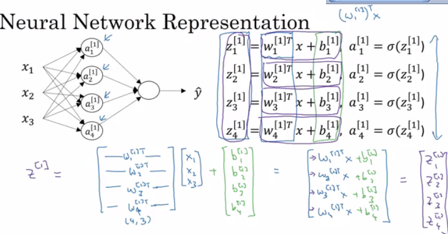
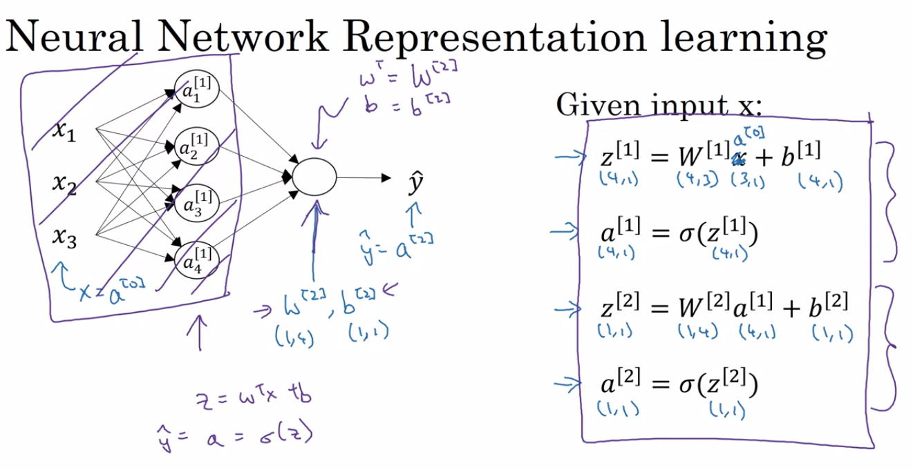

# Shallow neural networks

- Describe hidden units and hidden layers.
- Use units with a non-linear activation function, such as tanh.
- Implement forward and backward propagation.
- Apply random initialization to your neural network.
- Increase fluency in Deep Learning notations and Neural Network Representations.
- Implement a 2-class classification neural network with a single hidden layer.

## Table of contents

- [Shallow neural networks](#shallow-neural-networks)
  - [Table of contents](#table-of-contents)
  - [Neural Networks Overview](#neural-networks-overview)
  - [Neural Network Representation](#neural-network-representation)
    - [Layers](#layers)
    - [Nodes](#nodes)
    - [Examples](#examples)
    - [Results](#results)
    - [$W$ parameters](#w-parameters)
    - [$b$ parameters](#b-parameters)
    - [Activation functions](#activation-functions)
    - [Loss function](#loss-function)
      - [Cost function](#cost-function)
  - [Computing a Neural Network's Output](#computing-a-neural-networks-output)
  - [Vectorizing across multiple examples](#vectorizing-across-multiple-examples)
  - [Activation functions](#activation-functions-1)
    - [$Sigmoid$](#sigmoid)
    - [$Tanh$](#tanh)
    - [$ReLU$](#relu)
    - [$Leaky ReLU$](#leaky-relu)
    - [Choosing Activation Functions](#choosing-activation-functions)
  - [Why do you need non-linear activation functions?](#why-do-you-need-non-linear-activation-functions)
  - [Derivatives of activation functions](#derivatives-of-activation-functions)
    - [$Sigmoid$](#sigmoid-1)
    - [$Tanh$](#tanh-1)
    - [$ReLU$](#relu-1)
    - [$Leaky ReLU$](#leaky-relu-1)
  - [Gradient descent for Neural Networks](#gradient-descent-for-neural-networks)
    - [Two layers NN parameters](#two-layers-nn-parameters)
      - [Nodes](#nodes-1)
      - [$W$ parameters](#w-parameters-1)
      - [$b$ parameters](#b-parameters-1)
    - [Loss function](#loss-function-1)
      - [Cost function](#cost-function-1)
    - [Gradient descent algorithm](#gradient-descent-algorithm)
    - [Forward propagation](#forward-propagation)
    - [Back-propagation](#back-propagation)
    - [Parameters update](#parameters-update)
  - [Random Initialization](#random-initialization)

## Neural Networks Overview

- Logistic regression:

  1. $z = x^{T}w + b$
  2. $a = Sigmoid(z)$
  3. $loss = Loss(a, y)$

- Neural networks with two layers (one hidden layer):

  1. $Z^{[1]} = W^{[1]}x + b^{[1]}$
  2. $a^{[1]} = Sigmoid(Z^{[1]})$
  3. $Z^{[2]} = W^{[2]}x + b^{[2]}$
  4. $a^{[2]} = Sigmoid(Z^{[2]})$
  5. $loss = Loss(a^{[2]}, y)$

- $X$ is the input vector $[X_1, X_2, X_3]$.
- $Y$ is the output variable.
- NN is a stack of logistic regression objects.

## Neural Network Representation

- A NN has a input layer, multiple hidden layers and a output layers.
- Hidden layers means we cant see that layers' results.

### Layers

- $L$ is the number of countable layers (hidden + output).
- $^{[l]}$ is the layer number, where:
  - $l = 0$ is the input layer (not countable).
  - $0 < l < L$ are the hidden layers.
  - $l = L$ is the output layer.

### Nodes

- $N^{[l]}$ is the number of nodes in a layer $l$.
  - $N^{[0]}$ is the number of inputs (lines of $X$).
  - For $0 < l < L$, $N^{[l]}$ are the number of nodes in the hidden layer $l$ (lines of $A^[l]$).
  - $N^{[L]}$ is the number of outputs (lines of $Y$).
- $^{[l]}_{[n]}$ is the node number $n$ in the hidden layer $l$.

### Examples

- $M$ is the total number of examples.
- $^{(m)}$ is the example number identification.
- In a vectorized execution, $M$ always is the number of columns of $X$, $Z^{[l]}$, $A^{[l]}$.

### Results

- $Z^{[l]}$ is the result matrix of the layer $l$ for $Z^{[l]} = W*a1 + b$. 
  - Shape: $(N^{[l]}, M)$.
  - $Z^{[0]}$ isn't used.
  - For $0 < l < L$, $Z^{[l]}$ are the partial result matrix of the hidden layer $l$.
  - $Z^{[L]}$ is the partial result matrix of the output layer.

- $A^{[l]}$ is the result matrix of the layer $l$ for $A^{[l]} = Sigmoid(Z^{[l]})$. 
  - Shape: $(N^{[l]}, M)$.
  - $A^{[0]}$ is the input matrix $X$.
  - For $0 < l < L$, $A^{[l]}$ are the result matrix of the hidden layer $l$.
  - $A^{[L]}$ is the output matrix $Y$.

### $W$ parameters

- $W^{[l]}$ is the $W$ matrix of the layer $l$.
  - Shape: $(N^{[l]}, N^{[l-1]})$.
  - $W^{[0]}$ isn't used.

### $b$ parameters

- $b^{[l]}$ is the $b$ matrix of the layer $l$.
  - Shape: $(N^{[l]}, 1)$.
  - $b^{[0]}$ isn't used.

### Activation functions

- Represented by $Activation^{[l]}$ and computed by the associated function.
- Its derivative is represented by $dActivation^{[l]}$ and computed by the associated function.

### Loss function

- Represented by $Loss$ and computed by the function `Loss`.
- Its derivative is represented by $dLoss$ and computed by the function `dLoss`.

#### Cost function

- Represented by $I$ and computed by the function `Cost`.
- Its derivative is represented by $dI$ and computed by the function `dCost`.

## Computing a Neural Network's Output





- $L = 2$.
- $N^{[0]} = N_x = 3$ (Number of Inputs or Neurons in layer $0$).
- $N^{[1]} = 4$ (Number of Hidden Neurons in layer $1$).
- In the layer $l = 1$:
  - $W^{[1]}$ is a $(N^{[1]}, N_x)$ matrix.
  - $B^{[1]}$ is a $(N^{[1]}, M)$ matrix.
  - $Z^{[1]} = W^{[1]}X + b^{[1]}$ is a $(N^{[1]}, M)$ matrix.
  - $A^{[1]} = Sigmoid(z^{[1]})$ is a $(N^{[1]}, M)$ matrix.
- In the layer $l = 2$:
  - $W^{[2]}$ is a $(1, N^{[1]})$ matrix.
  - $B^{[2]}$ is a $(1, 1)$ matrix.
  - $Z^{[2]} = W^{[2]}a^{[1]} + b^{[2]}$ is a $(1, 1)$ matrix.
  - $A^{[2]} = Sigmoid(z^{[2]})$ is a $(1, M)$ matrix.

## Vectorizing across multiple examples

- Linear Forward Propagation for the 2 layers NN in the chapter before:

```python
for m in range(M):
    z[1, m] = np.dot(W1, x[m]) + b1
    a[1, m] = sigmoid(z[1, m])
    z[2, m] = np.dot(W2, a[1, m]) + b2
    a[2, m] = sigmoid(z[2, m])
```

- Vectorized Forward Propagation for the 2 layers NN in the chapter before:

```python
Z1 = np.dot(W1, A0) + b1
A1 = sigmoid(Z1)
Z2 = np.dot(W2, A1) + b2
A2 = sigmoid(Z2)
```

## Activation functions

### $Sigmoid$

```python
def Sigmoid(z):
    return 1 / (1 + np.exp(-z))
```

- Range: $(0, 1)$.
- The examples before use the $Sigmoid$ function, but in some cases other functions can be a lot better.
- $Sigmoid$ can lead us to gradient descent problem where the updates are so low.
- If the input is too small or too high, the slope will be near zero which will cause the gradient decent problem.

### $Tanh$

```python
def Tanh(z):
    return (np.exp(z) - np.exp(-z)) / (np.exp(z) + np.exp(-z))
```

- Range: $(-1, 1)$.
- Kind of a shifted version of sigmoid function.
- Numpy implementation for $Tanh$: `np.tanh(z)`.
- It turns out that the tanh activation usually works better than sigmoid activation function for hidden units because the mean of its output is closer to zero, and so it centers the data better for the next layer.
- If the input is too small or too high, the slope will be near zero which will cause the gradient decent problem.

### $ReLU$

```python
def ReLU(z):
    return max(0,z)
```

- $ReLU$ solve the slow gradient decent problem.
- If $z$ is negative the slope is $0$ and if $z$ is positive the slope remains linear.`

### $Leaky ReLU$

```python
def LeakyReLU(z, min_factor):
    return max(min_factor*z,z)
```

- If the input is negative the slope will be so small (and not $0$ as in the $ReLU$).
- It works as $ReLU$ but most people uses the original $ReLU$.

### Choosing Activation Functions

- If the classification is between $0$ and $1$, use the output activation as $Sigmoid$ and the others as $ReLU$.
- There are multiple hyper-parameters to be defined in a NN, choices like:
  - No of hidden layers.
  - No of neurons in each hidden layer.
  - Learning rate.
  - Activation functions.
  - And others..
- It turns out there are no guide lines for that. You should try all activation functions for example.

## Why do you need non-linear activation functions?

- Linear activation functions produce linear outputs.
- Whatever hidden layers the NN has, the activation will be always linear - like in the logistic regression. So its useless in a lot of complex problems.
- If the output is a real number (regression problem), it's indicated to use linear activation functions in the output layer. But even in this case if the output value is non-negative you could use ReLU instead.

## Derivatives of activation functions

### $Sigmoid$

```python
def dSigmoid(z):
    return (1 / (1 + np.exp(-z))) * (1 - (1 / (1 + np.exp(-z))))
```

```python
def dSigmoid(sigmoid_z):
    return sigmoid_z * (1 - sigmoid_z)
```

### $Tanh$

```python
def dTanh(z):
    return 1 - np.power((np.exp(z) - np.exp(-z)) / (np.exp(z) + np.exp(-z)), 2)
```

```python
def dTanh(tanh_z):
    return 1 - np.power(tanh_z, 2)
```

### $ReLU$

```python
def dReLU(z):
    return 0 if z < 0 else 1
```

### $Leaky ReLU$

```python
def dLeakyReLU(z, min_factor):
    return min_factor if z < 0 else 1
```

## Gradient descent for Neural Networks

### Two layers NN parameters

#### Nodes

- `n[0] = Nx`.
- `n[1]` is equal to $N^{[1]}$.
- `n[2] = 1`.

#### $W$ parameters

- `W1` shape is `(n[1],n[0])`
- `W2` shape is `(n[2],n[1])`

#### $b$ parameters

- `b1` shape is `(n[1],1)`
- `b2` shape is `(n[2],1)`

### Loss function

```python
def Loss(Y, A):
    return - (Y * np.log(A) + (1 - Y) * np.log(1 - A)) 
```

```python
def dLoss(Y, A):
    return A - Y 
```

#### Cost function

```python
def Cost(W1, b1, W2, b2):
    return (1/m) * np.sum(Loss(Y,A2))
```

### Gradient descent algorithm

- Using pseudo-code.

```
Repeat:
    Compute predictions (y'[i], i = 0,...m)
    Get derivatives: dW1, db1, dW2, db2
    Update: W1 = W1 - LearningRate * dW1
        b1 = b1 - LearningRate * db1
        W2 = W2 - LearningRate * dW2
        b2 = b2 - LearningRate * db2
```

### Forward propagation

```python
A0 = X
Z1 = np.dot(W1, A0) + b1
A1 = Activation[1](Z1)
Z2 = np.dot(W2, A1) + b2
A2 = Activation[2](Z2)
```

### Back-propagation

```python
# Output Layer
dZ2 = dLoss(A2, Y)
dW2 = np.dot(dZ2, A1.T) / m
db2 = np.sum(dZ2, axis=1, keepdims=True) / m
# Hidden Layer
dZ1 = np.dot(W2.T, dZ2) * dActivation[1](Z1)
dW1 = np.dot(dZ1, A0.T) / m
db1 = np.sum(dZ1, axis=1, keepdims=True) / m
```

- Transposes with multiplication is used to keep the dimensions correct.


### Parameters update

```python
W1 = W1 - learning_rate * dW1
b1 = b1 - learning_rate * db1
W2 = W2 - learning_rate * dW2
b2 = b2 - learning_rate * db2
```

## Random Initialization

- In contrary of the logistic regression, it is very important to initialize the weights randomly in NN.
- Initializing bias ($b$) with zero is OK.
- If we initialize all the $W$ weights with zeros in NN it won't work
  - All hidden units will be completely identical (symmetric) - computing the exactly the same function.
  - On each gradient descent iteration all the hidden units will always be updated with the same values.
- It's indicated to initialize $W$ with small random numbers.

```python
W1 = np.random.randn((2,2)) * 0.01    # 0.01 to make it small enough
b1 = np.zeros((2,1))
```

- We need small values because in $Sigmoid$ (or $Tanh$), for example, if the weight is too large you are more likely to end up even at the very start of training with very large values of $Z$, which saturates the activation function and slow down learning. If you don't have any $Sigmoid$ or $Tanh$ activation functions throughout your neural network, this is less of an issue.
- Constant `0.01` is alright for 1 hidden layer networks, but if the NN is deep this number can be changed but it will always be a small number.
