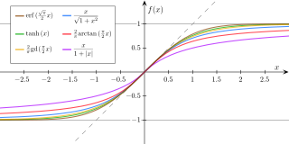
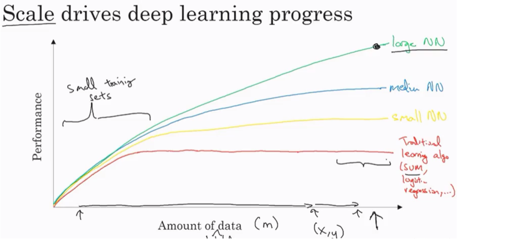

# Introduction to deep learning

> Be able to explain the major trends driving the rise of deep learning, and understand where and how it is applied today.

- Discuss the major trends driving the rise of deep learning.
- Explain how deep learning is applied to supervised learning.
- List the major categories of models (CNNs, RNNs, etc.), and when they should be applied.
- Assess appropriate use cases for deep learning

## Table of contents

- [Introduction to deep learning](#introduction-to-deep-learning)
  - [Table of contents](#table-of-contents)
  - [What is a neural network?](#what-is-a-neural-network)
  - [Supervised learning with neural networks](#supervised-learning-with-neural-networks)
  - [Why is deep learning taking off?](#why-is-deep-learning-taking-off)
  - [Test](#test)

## What is a neural network?

- Single neuron: linear regression without applying activation (perceptron).
- Basically a single neuron will calculate weighted sum of the input and then we can set a threshold to predict output in a perceptron. If weighted sum of the input crosses the threshold, perceptron fires and if not then perceptron doesn't predict.
- Perceptron can take real values input or boolean values.
- Actually, when `w*x + b = 0` the perceptron outputs 0.
- Disadvantage of perceptron is that it only outputs binary values and if we try to give small change in weight and bias then perceptron can flip the output. We need some system which can modify the output slightly according to small change in weight and bias. Here comes sigmoid function in picture.
- If we change perceptron with a sigmoid function, then we can make slight change in output.
- E.g. the output in perceptron is 0, you slightly changed weight and bias, output becomes = 1 but actual output is 0.7. In case of sigmoid, `output = 0`, slight change in weight and bias, `output = 0.7`. 
- If we apply sigmoid activation function then Single neuron will act as **Logistic Regression**.

- We can understand difference between perceptron and sigmoid function by looking at sigmoid function graph.
  - Reference: [Sigmoid function at Wikipedia](https://en.wikipedia.org/wiki/Sigmoid_function).

- Simple neural network (NN) graph:
  - Image taken from [tutorialspoint.com](http://www.tutorialspoint.com/)

- RELU stands for rectified linear unit is the most popular activation function right that makes deep NNs train faster.
- Hidden layers predicts connection between inputs automatically, thats what deep learning is good at.

- Deep NN consists of more hidden layers (Deeper layers)
  - Image taken from [opennn.net](http://www.opennn.net/)

- Each Input will be connected to the hidden layer and the NN will decide the connections.
- Supervised learning means we have the (X,Y) and we need to get the function that maps X to Y.

## Supervised learning with neural networks

- Different types of neural networks for supervised learning which includes:

  - CNN or convolutional neural networks (Useful in computer vision).
  - RNN or Recurrent neural networks (Useful in Speech recognition or NLP).
  - Standard NN (Useful for Structured data).
  - Hybrid/custom NN or a Collection of NNs types.

- Structured data is like the databases and tables.
- Unstructured data is like images, video, audio, and text.

## Why is deep learning taking off?

- Deep learning is taking off for 3 reasons:

  1. Data:
     - For small data NN can perform as Linear regression or SVM (Support vector machine).
     - For big data a small NN is better that SVM
     - For big data a big NN is better that a medium NN is better that small NN.
     - Hopefully we have a lot of data because the world is using the computer a little bit more

  2. Computation:
     - GPUs.
     - Powerful CPUs.
     - Distributed computing.
     - ASICs.

  3. Algorithm:
     1. Creative algorithms has appeared that changed the way NN works.
        - For example using RELU function is so much better than using SIGMOID function in training a NN because it helps with the vanishing gradient problem.

## Test

- [Quiz - Introduction to deep learning](Quiz%20-%20Introduction%20to%20deep%20learning.md).
