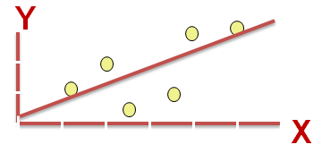
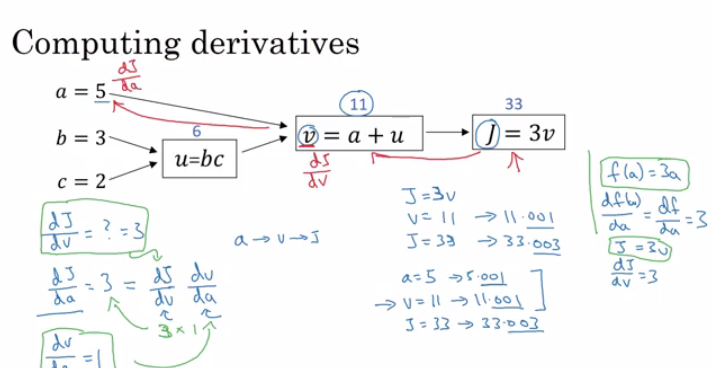

# Neural Networks Basics

- Build a logistic regression model structured as a shallow neural network.
- Build the general architecture of a learning algorithm, including parameter initialization, cost function and gradient calculation, and optimization implemetation (gradient descent).
- Implement computationally efficient and highly vectorized versions of models.
- Compute derivatives for logistic regression, using a backpropagation mindset.
- Use Numpy functions and Numpy matrix/vector operations.
- Work with iPython Notebooks.
- Implement vectorization across multiple training examples.

## Table of contents

- [Neural Networks Basics](#neural-networks-basics)
  - [Table of contents](#table-of-contents)
  - [Binary classification](#binary-classification)
  - [Logistic regression](#logistic-regression)
  - [Logistic regression cost function](#logistic-regression-cost-function)
  - [Gradient Descent](#gradient-descent)
  - [Derivatives](#derivatives)
  - [More Derivatives examples](#more-derivatives-examples)
  - [Computation graph](#computation-graph)
  - [Derivatives with a Computation Graph](#derivatives-with-a-computation-graph)
  - [Logistic Regression Gradient Descent](#logistic-regression-gradient-descent)
  - [Gradient Descent on m Examples](#gradient-descent-on-m-examples)
  - [Vectorization](#vectorization)
  - [Vectorizing Logistic Regression](#vectorizing-logistic-regression)
  - [Notes on Python and NumPy](#notes-on-python-and-numpy)
  - [General Notes](#general-notes)
  - [Test](#test)

## Binary classification

- How to do a logistic regression to make a binary classifier.
  - Image taken from [3.bp.blogspot.com](http://3.bp.blogspot.com)



- E.g. "The current image contains a cat or not?".

- Notations:
  - `M` is the number of training vectors.
  - `Nx` is the size of the input vector.
  - `Ny` is the size of the output vector.
  - `X(1)` is the first input vector.
  - `Y(1)` is the first output vector.
  - `X = [x(1) x(2).. x(M)]` is the array of inputs vectors.
  - `Y = [y(1) y(2).. y(M)]` is the array of output vectors.

## Logistic regression

- The algorithm is used as a classification algorithm of 2 classes.

- Equations:
  - Scalar equation: `y = w*x + b`
  - Vector equation: `y = w.T*X + b`
  - If we need y to be in between 0 and 1 (probability): `y = sigmoid(w.T*X + b)`
  - In some notations this might be used: `y = sigmoid(w.T*X)`
    - While `b` is `w0` of `w` and we add `x0 = 1`.
- In binary classification `Y` has to be between `0` and `1`.
- In the last equation `w` is a vector of `Nx` and `b` is a real number

## Logistic regression cost function

- A common loss function is the square root error:  `L(y',y) = 1/2 (y' - y)**2`
  - It has a big optimization problem: is non-convex, means it contains multiple local optimum points.

- A better alternative is: `L(y',y) = - (y*log(y') + (1-y)*log(1-y'))`
  - It has a lower computation cost and is convex, having only one optimum point.
  - To understand the function:
    - if `y = 1`, then `L(y',1) = -log(y')`. `y'` should be the largest, so `y`' biggest value is 1
    - if `y = 0`, then `L(y',0) = -log(1-y')`. `1-y'` should be the largest, `y'` to be smaller as possible because it can only has 1 value.

- Then the Cost function will be: `J(w,b) = (1/m) * Sum(L(y'[i],y[i]))`.
- The loss function computes the error for a single training example; the cost function is the average of the loss functions of the entire training set.

## Gradient Descent

- We want to predict `w` and `b` that minimize the cost function (the convex function `J(w,b)`).
- First we initialize `w` and `b` to `0.0` (most common) or initialize them to a random value in the convex function and then try to improve the values the reach minimum value.

- The gradient decent algorithm repeats: `w = w - alpha * dw`
  - `alpha` is the learning rate.
  - `dw` is the derivative (slope) of `w`.
- The derivative give us the direction to improve our parameters.

- The actual equations we will implement:
  - `w = w - alpha * d(J(w,b) / dw)` - how much the function slopes in the w direction.
  - `b = b - alpha * d(J(w,b) / db)` - how much the function slopes in the d direction.

## Derivatives

- Derivative of a linear line is its slope.
  - If `f(a) = 3a`, then `d(f(a))/d(a) = 3`.
    - If `a = 2` then `f(a) = 6`
    - If we move a a little bit `a = 2.001` then `f(a) = 6.003` means that we multiplied the derivative (Slope) to the moved area and added it to the last result.

## More Derivatives examples

- If `f(a) = a^2`, then `d(f(a))/d(a) = 2a`.
  - `a = 2` | `f(a) = 4`
  - `a = 2.0001` | `f(a) ≃ 4.0004`.

- If `f(a) = a^3`, then `d(f(a))/d(a) = 3a^2`.
- If `f(a) = log(a)`, then `d(f(a))/d(a) = 1/a`.

- To conclude, derivative is the slope and slope is different in different points in the function thats why the derivative is a function.

## Computation graph

- Its a graph that organizes the computation from left to right.


## Derivatives with a Computation Graph

- Calculus chain rule says:
  - If `x -> y -> z` (x effect y and y effects z), then `d(z)/d(x) = d(z)/d(y) * d(y)/d(x)`.



- We compute the derivatives on a graph from right to left and it will be a lot more easier.
- `dvar` means the derivatives of a final output variable with respect to various intermediate quantities.

## Logistic Regression Gradient Descent

- Derivatives of gradient decent example for one sample with two features `x1` and `x2`.


## Gradient Descent on m Examples

- Lets say we have these variables:

```
X1                  Feature
X2                  Feature
W1                  Weight of the first feature.
W2                  Weight of the second feature.
B                   Logistic Regression parameter.
M                   Number of training examples
Y(i)                Expected output of i
```

- So we have:


- Then from right to left we will calculate derivations compared to the result:

```
d(a)  = d(l)/d(a) = -(y/a) + ((1-y)/(1-a))
d(z)  = d(l)/d(z) = a - y
d(W1) = X1 * d(z)
d(W2) = X2 * d(z)
d(B)  = d(z)
```

- From the above we can conclude the logistic regression pseudo code:

```python
J = 0; dw1 = 0; dw2 =0; db = 0; # Devs.
w1 = 0; w2 = 0; b=0;            # Weights
for i = 1 to m
    # Forward pass
    z(i) = W1*x1(i) + W2*x2(i) + b
    a(i) = Sigmoid(z(i))
    J += (Y(i)*log(a(i)) + (1-Y(i))*log(1-a(i)))

    # Backward pass
    dz(i) = a(i) - Y(i)
    dw1 += dz(i) * x1(i)
    dw2 += dz(i) * x2(i)
    db  += dz(i)
J /= m
dw1/= m
dw2/= m
db/= m

# Gradient descent
w1 = w1 - alpha * dw1
w2 = w2 - alpha * dw2
b = b - alpha * db
```

- The above code should run for some iterations to minimize error.

- So there will be two inner loops to implement the logistic regression.

- Vectorization is so important on deep learning to reduce loops. In the last code we can make the whole loop in one step using vectorization!

## Vectorization

- Deep learning shines when the dataset are big. However for loops will make you wait a lot for a result. Thats why we need vectorization to get rid of some of our for loops.
- NumPy library (`dot`) function is using vectorization by default.
- The vectorization can be done on CPU or GPU thought the SIMD operation. But its faster on GPU.
- Whenever possible avoid for loops.
- Most of the NumPy library methods are vectorized version.

## Vectorizing Logistic Regression

- We will implement Logistic Regression using one for loop then without any for loop.
- As an input we have a matrix `X` and its `[Nx, m]` and a matrix `Y` and its `[Ny, m]`.
- We will then compute at instance `[z1,z2...zm] = W' * X + [b,b,...b]`. This can be written in python as:

```python
Z = np.dot(W.T,X) + b    # Vectorization, then broadcasting, Z shape is (1, m)
A = 1 / 1 + np.exp(-Z)   # Vectorization, A shape is (1, m)
```

- Vectorizing Logistic Regression's Gradient Output:

```python
dz = A - Y                  # Vectorization, dz shape is (1, m)
dw = np.dot(X, dz.T) / m    # Vectorization, dw shape is (Nx, 1)
db = np.sum(dz) / m           # Vectorization, dz shape is (1, 1)
```

## Notes on Python and NumPy

- In NumPy, `obj.sum(axis = 0)` sums the columns while `obj.sum(axis = 1)` sums the rows.
- In NumPy, `obj.reshape(1,4)` changes the shape of the matrix by broadcasting the values.
- Reshape is cheap in calculations so put it everywhere you're not sure about the calculations.
- Broadcasting works when you do a matrix operation with matrices that doesn't match for the operation, in this case NumPy automatically makes the shapes ready for the operation by broadcasting the values.
- In general principle of broadcasting. If you have an `(m,n)` matrix and you add (`+`) or subtract (`-`) or multiply (`*`) or divide (`/`) with a `(1,n)` matrix, then this will copy it m times into an `(m,n)` matrix. The same with if you use those operations with a `(m,1)` matrix, then this will copy it n times into `(m,n)` matrix. And then apply the addition, subtraction, and multiplication of division element wise.

- Some tricks to eliminate all the strange bugs in the code:
  - If you didn't specify the shape of a vector, it will take a shape of `(m,)` and the transpose operation won't work. You have to reshape it to `(m, 1)`
  - Try to not use the rank one matrix in ANN
  - Don't hesitate to use `assert(a.shape == (5,1))` to check if your matrix shape is the required one.
  - If you've found a rank one matrix try to run reshape on it.

- Jupyter / IPython notebooks are so useful library in python that makes it easy to integrate code and document at the same time. It runs in the browser and doesn't need an IDE to run.
  - To open Jupyter Notebook, open the command line and call: `jupyter-notebook` It should be installed to work.

- To Compute the derivative of Sigmoid:

```python
s = sigmoid(x)
ds = s * (1 - s)       # derivative  using calculus
```

- To make an image of `(width,height,depth)` be a vector, use this:

```python
v = image.reshape(image.shape[0]*image.shape[1]*image.shape[2],1)  #reshapes the image.
```

- Gradient descent converges faster after normalization of the input matrices.

## General Notes

- The main steps for building a Neural Network are:
  - Define the model structure (such as number of input features and outputs).
  - Initialize the model's parameters.
  - Loop.
    - Calculate current loss (forward propagation).
    - Calculate current gradient (backward propagation).
    - Update parameters (gradient descent).

- Preprocessing the dataset is important.
- Tuning the learning rate (which is an example of a "hyperparameter") can make a big difference to the algorithm.
- [kaggle.com](kaggle.com) is a good place for datasets and competitions.
- [Pieter Abbeel](https://www2.eecs.berkeley.edu/Faculty/Homepages/abbeel.html) is one of the best in deep reinforcement learning.

## Test

- [Quiz - Neural Network Basics](Quiz%20-%20Neural%20Network%20Basics.md).
- [PA 1 - Python Basics with Numpy](Python%20Basics%20With%20Numpy/Python%20Basics%20With%20Numpy.ipynb).
- [PA 2 - Logistic Regression with a Neural Network mindset](Logistic%20Regression%20as%20a%20Neural%20Network/Logistic_Regression_with_a_Neural_Network_mindset_v6a.ipynb).
