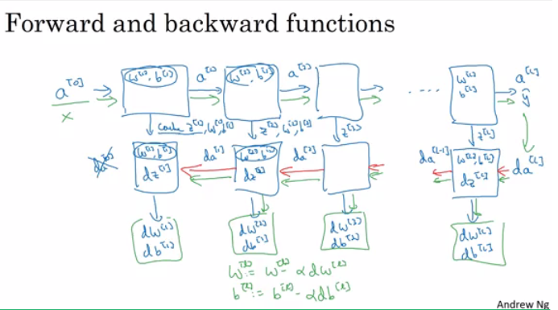

# Deep Neural Networks

- Describe the successive block structure of a deep neural network
- Build a deep L-layer neural network
- Analyze matrix and vector dimensions to check neural network implementations
- Use a cache to pass information from forward to back propagation
- Explain the role of hyper-parameters in deep learning

## Table of contents

- [Deep Neural Networks](#deep-neural-networks)
  - [Table of contents](#table-of-contents)
  - [Deep L-layer neural network](#deep-l-layer-neural-network)
    - [Pseudo Annotation](#pseudo-annotation)
    - [Code Annotation](#code-annotation)
  - [Forward Propagation in a Deep Network](#forward-propagation-in-a-deep-network)
  - [Getting your matrix dimensions right](#getting-your-matrix-dimensions-right)
  - [Why deep representations?](#why-deep-representations)
  - [Building blocks of deep neural networks](#building-blocks-of-deep-neural-networks)
  - [Forward and Backward Propagation](#forward-and-backward-propagation)
    - [Forward Propagation](#forward-propagation)
    - [Backward Propagation](#backward-propagation)
      - [](#)
  - [Parameters vs Hyper-parameters](#parameters-vs-hyper-parameters)
  - [What does this have to do with the brain](#what-does-this-have-to-do-with-the-brain)

## Deep L-layer neural network

- Shallow NN: 1 or 2 layers (0 or hidden layers).
- Deep NN: 3 or more layers (2 or more hidden layers).

### Pseudo Annotation

- $L$ is the number of countable layers (hidden + output).
- $N^{[l]}$ is the number of neurons in a layer $l$.
- $N^{[0]}$ is the number of neurons in the input layer.
- $N^{[L]}$ is the number of neurons in the output layer.
- $Activation^{[l]} = G^{[l]}$
- $A^{[l]} = Activation^{[l]}(Z^{[l]})$ is the output of the layer $l$.
- $A^{[0]} = Activation^{[0]}(Z^{[0]})$ is the NN input.
- $A^{[L]} = Activation^{[L]}(Z^{[L]})$ is the NN output.
- $Z^{[l]} = W^{[l]}.A^{[l-1]} + b^{[l]}$
- $W^{[l]}$ is the $W$ matrix of the layer $l$.
- $b^{[l]}$ is the $b$ matrix of the layer $l$.

### Code Annotation

- `L` is the number of countable layers (hidden + output).
- `n[l]` is the number of neurons in a layer `l`.
- `n[0]` is the number of neurons in the input layer.
- `n[L]` is the number of neurons in the output layer.
- `Activation[l] = g[l]`
- `A[l] = Activation[l](Z[l])` is the output of the layer `l`.
- `A[0] = Activation[0](Z[0])` is the NN input.
- `A[L] = Activation[L](Z[L])` is the NN output.
- `Z[l] = np.dot(W[l], A[l-1]) + b[l]`
- `W[l]` is the $W$ matrix of the layer $l$.
- `b[l]` is the $b$ matrix of the layer $l$.

## Forward Propagation in a Deep Network

- Forward propagation general rule for one input:

```python
z[l] = np.dot(W[l], a[l-1]) + b[l]
a[l] = Activation[l](a[l])
```

- Forward propagation general rule for `m` inputs:

```python
Z[l] = np.dot(W[l], A[l-1]) + b[l]
A[l] = Activation[l](A[l])
```

- We can't compute the whole layers forward propagation without a for loop so its OK to have a for loop here.
- The dimensions of the matrices are so important you need to figure it out.

## Getting your matrix dimensions right

- `W.shape == (n[l], n[l-1])`
- `b.shape == (n[l], 1)`
- `dw.shape == W.shape`
- `db.shape == b.shape`
- `Z[l].shape == A[l].shape == dZ[l].shape == dA[l] == (n[l], m)`

## Why deep representations?

- When starting on an application don't start directly by dozens of hidden layers. Try the simplest solutions (e.g. Logistic Regression), then try the shallow neural network and so on.
- Deep NN makes relations with data from simpler to complex. In each layer it tries to make a relation with the previous layer. E.g.:
  - 1) Face recognition application:
      - Image ==> Edges ==> Face parts ==> Faces ==> desired face
  - 2) Audio recognition application:
      - Audio ==> Low level sound features like (sss,bb) ==> Phonemes ==> Words ==> Sentences
  - 3) Circuit theory.

## Building blocks of deep neural networks

- Forward and back propagation for a layer l:


- Deep NN blocks:



## Forward and Backward Propagation

### Forward Propagation

- Cache are recommended to optimize the slope calculation, considering it uses function value in the point (`Z[l]`).

```python
Z[l] = np.dot(W[l], A[l-1]) + b[l]
A[l] = Activation[l](Z[l])
ZCache[l] = Z[l]
ACache[l] = A[l]
```

- Inputs: `A[l-1]`
- Outputs: `A[l]`, `ZCache[l]`, `ACache[l]`
- Start: First Hidden Layer.
  - `A[l-1] == X`

### Backward Propagation

```python
dZ[l] = dA[l] * dActivation[l](ZCache[l])
dW[l] = np.dot(dZ[l], ACache[l-1].T) / m
db[l] = np.sum(dZ[l], axis=1, keepdims=True) / m
dA[l-1] = np.dot(W[l].T, dZ[l])
```

- Inputs: `dA[l]`, `ZCache[l]`, `ACache[l]`
- Outputs: `dA[l-1]`, `dW[l]`, `db[l]`.
- Start: Last Hidden Layer.
  - `dA[L] == - (Y/A[L]) + ((1 - Y) / (1 - A[L]))`
  - `dA[L] == dLoss(A[L], Y)`

#### 

## Parameters vs Hyper-parameters

- Main parameters of the NN is `W` and `b`.
- Hyper-parameters (parameters that control the algorithm) are like:
  - Learning rate.
  - Number of iteration.
  - Number of hidden layers `L`.
  - Number of hidden units `n`.
  - Choice of activation functions.
- You have to try values yourself of hyper-parameters.
- In the earlier days of DL and ML learning rate was often called a parameter, but it really is (and now everybody call it) a hyper-parameter.
- On the next course we will see how to optimize hyper-parameters.

## What does this have to do with the brain

- The analogy that "It is like the brain" has become really an oversimplified explanation.
- There is a very simplistic analogy between a single logistic unit and a single neuron in the brain.
- No human today understand how a human brain neuron works.
- No human today know exactly how many neurons on the brain.
- Deep learning in Andrew's opinion is very good at learning very flexible, complex functions to learn X to Y mappings, to learn input-output mappings (supervised learning).
- The field of computer vision has taken a bit more inspiration from the human brains then other disciplines that also apply deep learning.
- NN is a small representation of how brain work. The most near model of human brain is in the computer vision (CNN).
